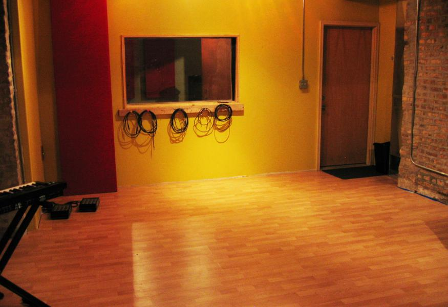
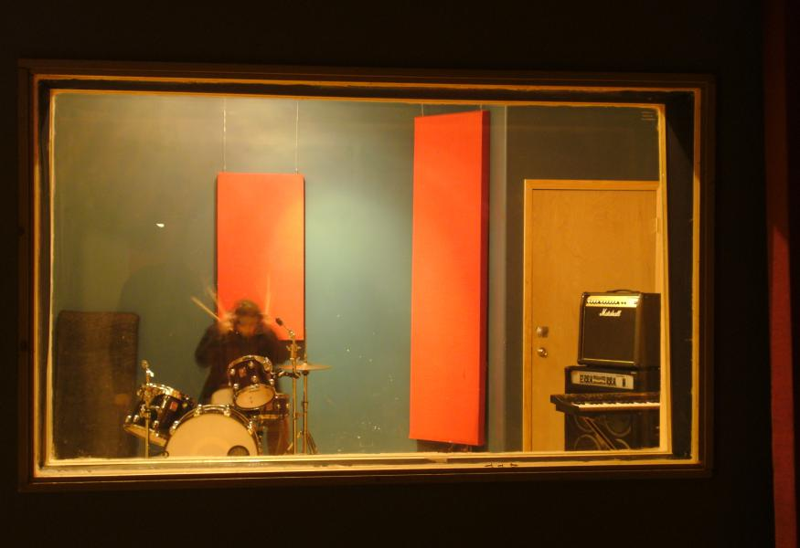

#### Vacancy -- 1 membership slot open.
We keep this page updated with any openings, or you can email us at soapboxchicago@gmail.com, [sign up for our email newsletter](https://mailchi.mp/767a7c6ab28c/soapbox-newsletter), or [follow us on Facebook](http://www.facebook.com/soapboxchicago) to be notified of an opening. We often post openings on [chicago.craigslist.org](http://chicago.craigslist.org), too.

Whether you are a band or recording engineer, you need physical space to be productive.  As an alternative to clinical recording studios and noisy rehearsal spaces, we have a studio space that is split among 4 bands. Our belief is that the essence of recording is to document live music as it unfolds, so that these moments can then be shared with the world. The hardest challenge in playing music in a city is eliminating distractions, which is why simplicity is our guiding principle.  A quiet space, a few versatile microphones, and a great sounding room is all that is needed. A studio should be functional, simple, and most importantly, fun. (somewhere in between a roller coaster ride and chucky e. cheese's is about right.) For more info or to schedule a showing please email us at soapboxchicago@gmail.com.

Great option for bands that would like an affordable place to rehearse + the option to record themselves.

- 24 hour keyed access
- Work out scheduling with other bands using a shared calendar
- Bring your own equipment & gear or use ours
- 4 bands max share the space (you would be one of them)
- Security system
- Access to the 18'x20' live room with all our instruments & amps (see below)    
- Access to the 12'x13' control room, and use of our recording equipment (see below)
- Standalone building
- Acoustically treated
 
 

 

### Shared equipment:
 
#### Microphones

- Rode NT4 Stereo Condensor
- Audio Technica AT4050 Large Condensor
- Audio Technica AT2020 Large Condensor
- SM57 (3)
- SM58 (2)
- Sennheiser 421 (2)
- Electrovoice RE-27 (2)

#### Instruments & Amps

- Premier Genista 100% Birch kit (10" tom, 14" tom, 14" snare, 22" kick)
- Zildjian Cymbals, DW Pedal
- Emperor 2x12 Cabinet
- Custom Tweed 1x15 Pine Guitar Cabinet
- Fender Bass Amp
- Marshall Guitar Amp
- Yamaha 250 watt PA with 10 channel mixer (pair)

#### Software

- Harrison Mixbus

####  Hardware & Monitoring

- Seventh Circle Preamps
- Tango / Echo
- Overstayer FET compressor
- Serpent Audio VCA compressor
- Mac OS X
- B&W DM303
- Auratone 5Cs

#### Other:

Mic stand(s), cables

